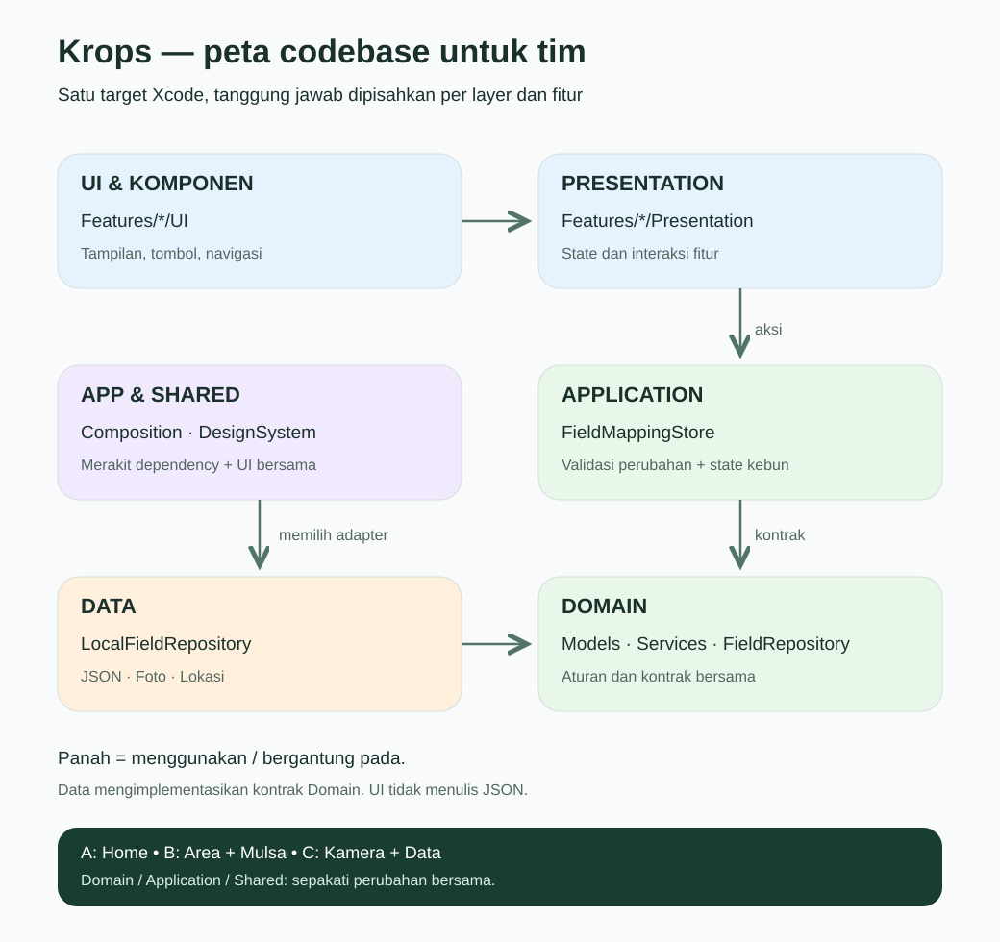

# Arsitektur Krops / Nyawits

## Mulai dari sini

Project menggunakan pemisahan layer dalam satu target Xcode. Ini memudahkan tim kecil
tanpa konfigurasi package terpisah. Batas layer adalah aturan source code; compiler
belum mengisolasinya menjadi modul terpisah.

| Folder | Tanggung jawab | Tempat mengedit |
| --- | --- | --- |
| App | Merakit dependency konkret | FieldMappingStore+Composition |
| Features/*/UI | Screen, navigasi, state presentasi lokal | Home, FieldAreaSelection, MulchRowSetup, PlantMapping |
| Features/*/UI/Components | Bagian layar yang dapat diedit mandiri | HomeHeader, HomeFieldsSection, FieldAreaPanel, MulchRowPanel, CaptureControls |
| Features/*/Presentation | ViewModel dan format data untuk layar | FieldAreaSelectionViewModel, MulchRowSetupViewModel, PlantCaptureViewModel |
| Application | Operasi kebun dan state bersama | FieldMappingStore |
| Domain/Models | Struktur kebun, batas, baris, observasi | MappedField, FieldBoundary, MulchRowPlan |
| Domain/Services | Geometri, validasi, pengurutan | FieldGeometryCalculator, FieldOrdering |
| Domain/Repositories | Kontrak penyimpanan | FieldRepository |
| Data | Implementasi JSON, foto, lokasi | LocalFieldRepository, FieldLocationService |
| Shared | Komponen lintas fitur, warna/font, fixture demo | Components, DesignSystem, PreviewData |

## Alur satu tindakan

Pengguna menekan Simpan → screen/ViewModel memanggil FieldMappingStore →
store memvalidasi kandidat → FieldRepository menyimpan →
LocalFieldRepository menulis atomik → store menerbitkan state baru → UI diperbarui.
Kegagalan menulis tidak boleh menerbitkan kandidat sebagai data tersimpan.

Application hanya mengenal kontrak FieldRepository. Implementasi lokal dipilih
oleh extension di App. Untuk pengujian, gunakan
`FieldMappingStore(repository: fakeRepository)`.
Initializer lama dengan storageRoot tetap tersedia untuk preview dan kompatibilitas.

## Aturan menambah fitur

1. Buat screen di Features/NamaFitur/UI dan komponen di UI/Components.
2. Komponen kecil menerima nilai dan closure aksi. Panel yang mengedit banyak
   state fitur boleh menerima @ObservedObject ViewModel; kepemilikan tetap di screen.
3. Tempatkan state bisnis/presentasi di Presentation, bukan dalam dekorasi kartu.
4. Model dan aturan yang dipakai banyak fitur masuk Domain.
5. Akses file baru harus lewat kontrak repository; UI tidak menulis JSON sendiri.
6. Jangan membuat Domain bergantung pada Features atau Data.
7. Screen tetap memiliki navigasi, alert, lifecycle, dan penghubung komponen.
   Tidak perlu menjadikan setiap Text atau Spacer sebuah file.

## Pembagian kerja 2–3 orang

Heatmap dan kamera berada dalam satu paket Features/PlantMapping:
Heatmap (renderer/kartu), Capture (kamera/ViewModel/kontrol), dan Plants
(daftar/detail hasil). Mulai dari PLANT_MAPPING_GUIDE.md di folder tersebut.
Komponen heatmap tidak lagi berada di Home. Model dan repository lintas fitur
tetap di Domain/Application/Data.

Pemupukan sekarang dimiliki oleh Features/Fertilization dan Aksi oleh
Features/FieldActions. Baca FERTILIZATION_GUIDE.md dan FIELD_ACTIONS_GUIDE.md untuk peta file dan
langkah mengganti simulasi dengan data nyata. Home hanya menyusun
FertilizationFeature dan FieldActionsFeature, serta mengirim fieldID/isDemo.
Domain dan Data di dalam dua fitur ini bersifat lokal fitur, bukan model bersama.

- Orang A: Home (dashboard, kebun, detail/riwayat).
- Orang B: FieldAreaSelection + MulchRowSetup (peta dan geometri).
- Orang C: PlantMapping + Data (kamera, foto, persistence).

Untuk dua orang, gabungkan pekerjaan B dan C. Sepakati perubahan Domain,
Application, dan Shared lebih dulu karena dipakai bersama.
Gunakan satu branch per fitur, PR kecil, dan hindari mengubah project.pbxproj
tanpa kebutuhan. Folder tersinkronisasi Xcode otomatis memasukkan Swift baru.

## Kompatibilitas data dan batas refactor

Nama file mapped-fields.json, active-field.json, PlantPhotos dan strategi tanggal
ISO-8601 dipertahankan. Tidak ada migrasi atau penghapusan data pengguna.
Domain masih memakai CoreLocation/MapKit untuk tipe koordinat dan matematika peta.
PlantCaptureViewModel masih mengelola lifecycle ARKit; ini adapter fitur iOS,
bukan domain yang sepenuhnya bebas platform. Pembacaan gambar pada beberapa UI
detail tetap lokal. Refactor ini tidak mengganti pipeline kamera atau rendering heatmap.

## Verifikasi

Jalankan `DEVELOPER_DIR=/Applications/Xcode-beta.app/Contents/Developer bash scripts/test-architecture.sh`.
Tes memakai folder temporer, menguji round-trip JSON/selection, foto, penolakan
path traversal dan rollback ketika repository gagal menyimpan.

Build: buka nyawits.xcodeproj, pilih scheme nyawits, lalu Build.
Format project lokal saat refactor adalah Xcode 27; jangan menganggap build
Xcode 26 didukung sebelum format/SDK project disesuaikan kembali.

Uji perangkat: tambah kebun → atur batas → atur mulsa → foto → simpan →
buka ulang → pilih kebun → edit/riwayat. Hardware kamera/GPS memerlukan iPhone.
